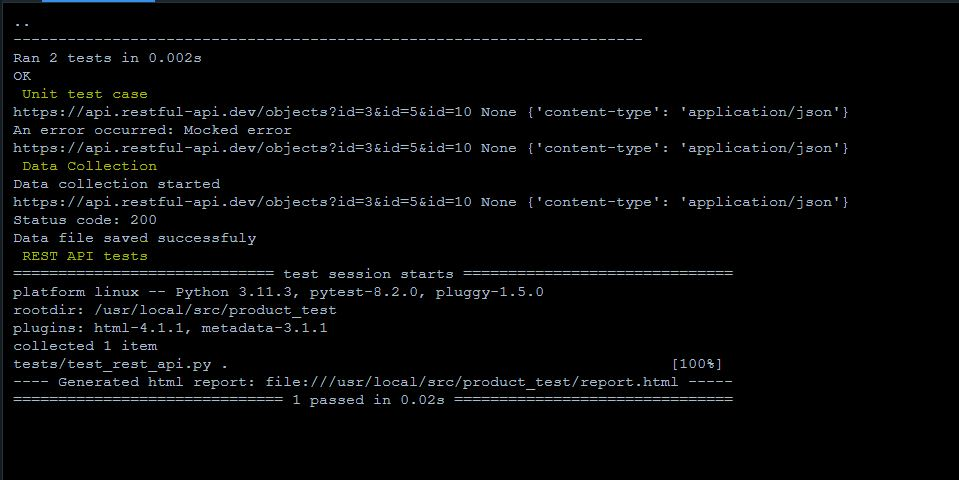
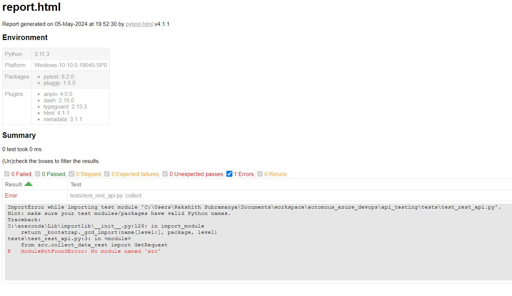
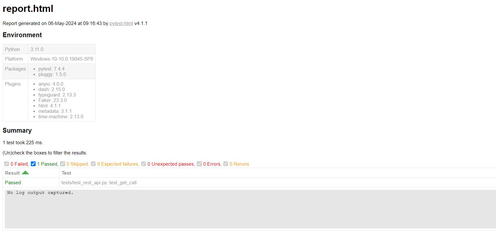

# REST API data collector and REST API testing
Data collection module from https://restful-api.dev/


## Introduction

This codebase implements data collection from https://restful-api.dev/
https://restful-api.dev/ is a sample RESTFUL-API website available 24X7 for experimenting various REST API calls.
This codebase implements a python script to accumulate the data from a GET endpoint. Unit test cases are implemented to ensure the intigrity of the code.
Once the data is collected, it is stored as a JSON file. This JSON data would be proper if the REST call is successful. Usiing Pytest, the collected data is tested and testcase report is generated.

## Description

The collector and REST API testing scripts are implemented within Linux environment using Docker.
The Dockerfile creates an image of the whole codebase and upon running the image, the container logs will show the test case status. This repository could also be executed within Windows or Mac operating systems. 

### Tests

Following tests are considered.
* Unit test cases
* REST API tests


## Env info
For python module dependency list, please see the requirements.txt
```
python - 3.11.0
```

## Output
### Docker output
 

### Failed testcase
If the testcase fails, the output would be as shown below.
 

### Passed testcase
 

## Authors
Ranjitha Jois; 

## License
This Source Code Form is subject to the terms of the Mozilla Public
License, v. 2.0. If a copy of the MPL was not distributed with this
file, You can obtain one at http://mozilla.org/MPL/2.0/.

